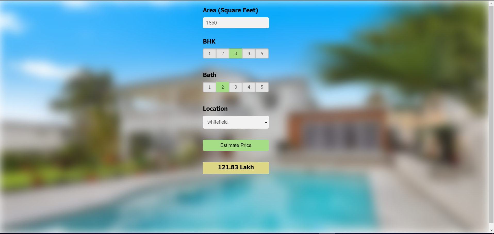
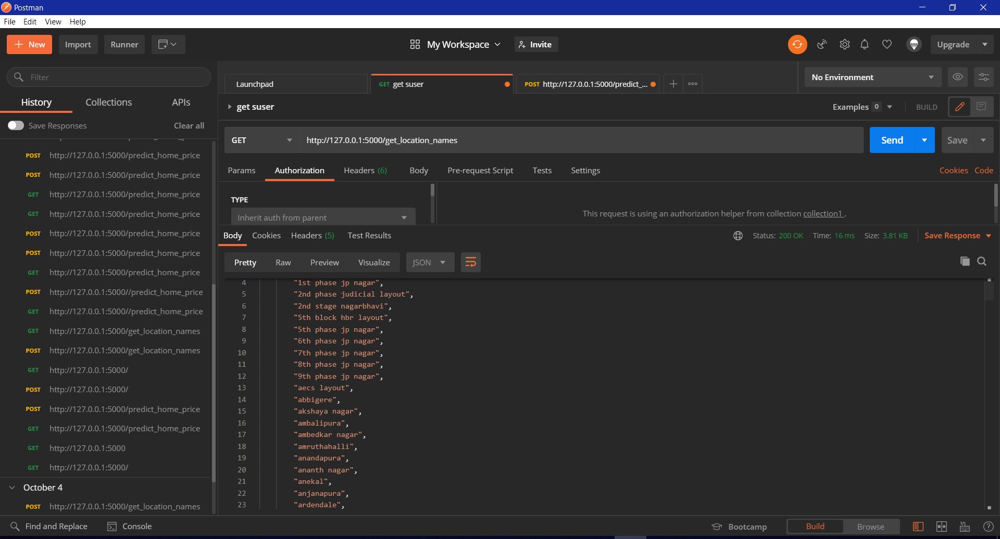

  
  Banglore_Houseprice_prediction
Used a Banglore house dataset to predict the price of the houses in the various regions in Banglore

This is a complete project to build a real estate price prediction website using flask API.
Built a model using sklearn and linear regression using the data from kaggle.com.
Run the model file on the flask server.
Building an interactive website using HTML, CSS, javascript that allows users to enter the values like bhk, number of bathrooms, and sqft.
 
Technology and tool used for the project:

1.Numpy and Pandas for data cleaning
2.Matplotlib for data visualization
3.Sklearn for model building
4.Jupyter notebook, visual studio code, and spyder as IDE
5Python flask for HTTP server
6.Used postman to see the get and the post command
7.HTML/CSS/Javascript for UI

